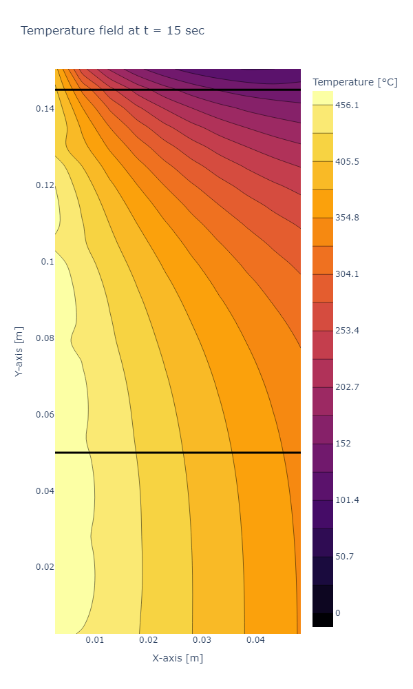

## Mech 568 Project Archive
This contains the submitted version of the computational modeling project for Mech 568. 
The project models the heat transfer for the furnace during pyrolysis experiments.
The model code is: `project.py`, the remaining files are initial results. 

